# Helparo Services - Flow Diagrams & Visual Representations

## Executive Summary

This document provides comprehensive visual flow diagrams for all key user journeys and system processes within the Helparo Services platform. These diagrams illustrate the complete user experience flows for customers, helpers, and administrators, showcasing the platform's efficiency, security, and user-centric design.

## Platform Architecture Overview

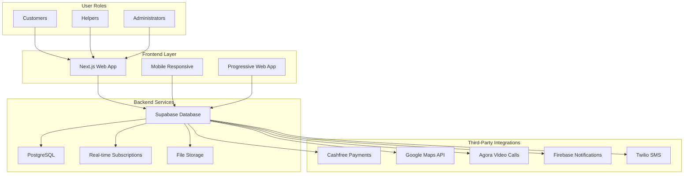

## 1. Customer Onboarding & Registration Flow

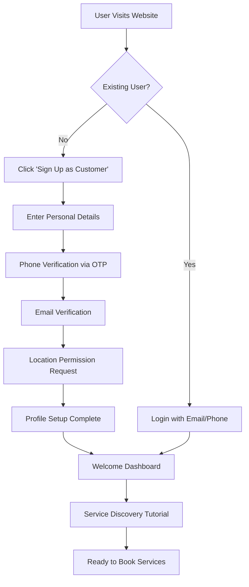

## 2. Helper Registration & Verification Flow

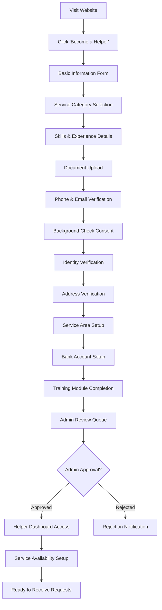

## 3. Service Request Creation Flow

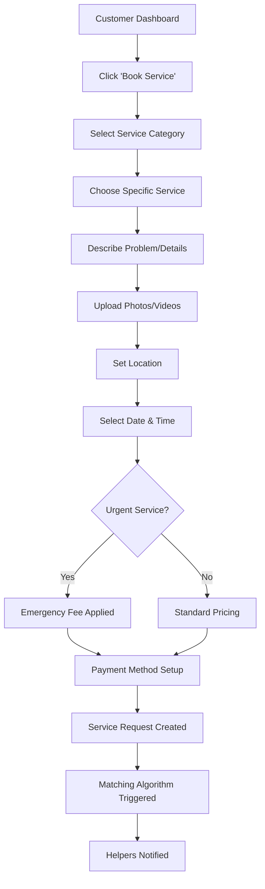

## 4. Smart Matching & Bidding System Flow

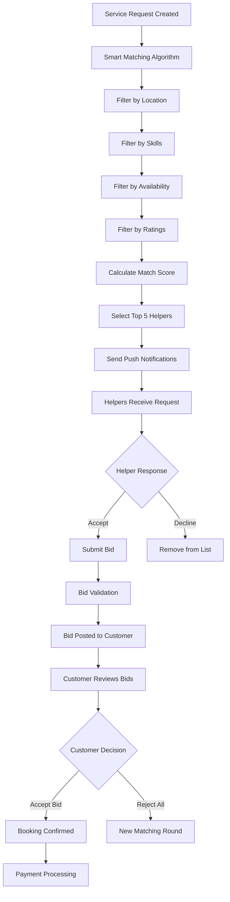

## 5. Booking & Payment Flow

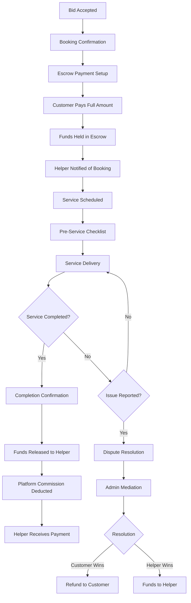

## 6. Service Delivery & Time Tracking Flow

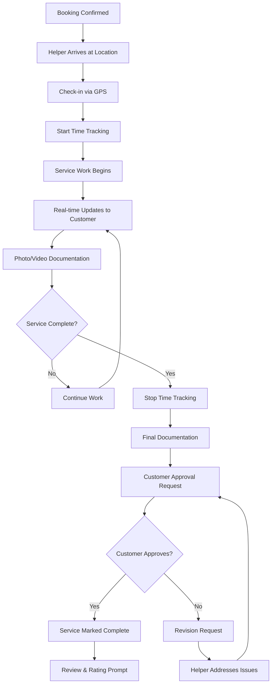

## 7. Review & Rating System Flow

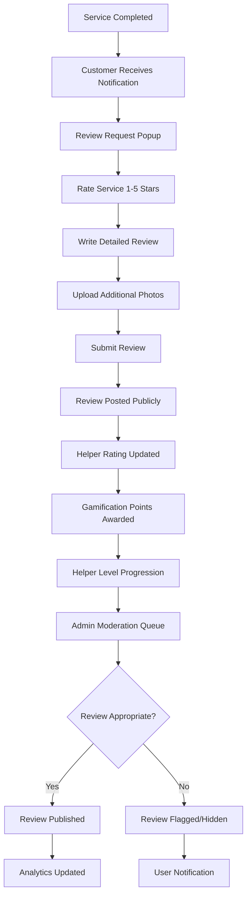

## 8. Emergency SOS Flow

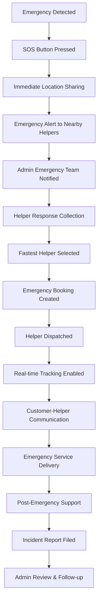

## 9. Subscription & Bundle Purchase Flow

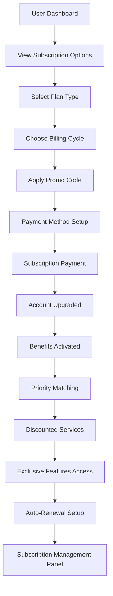

## 10. Admin Dashboard Management Flow

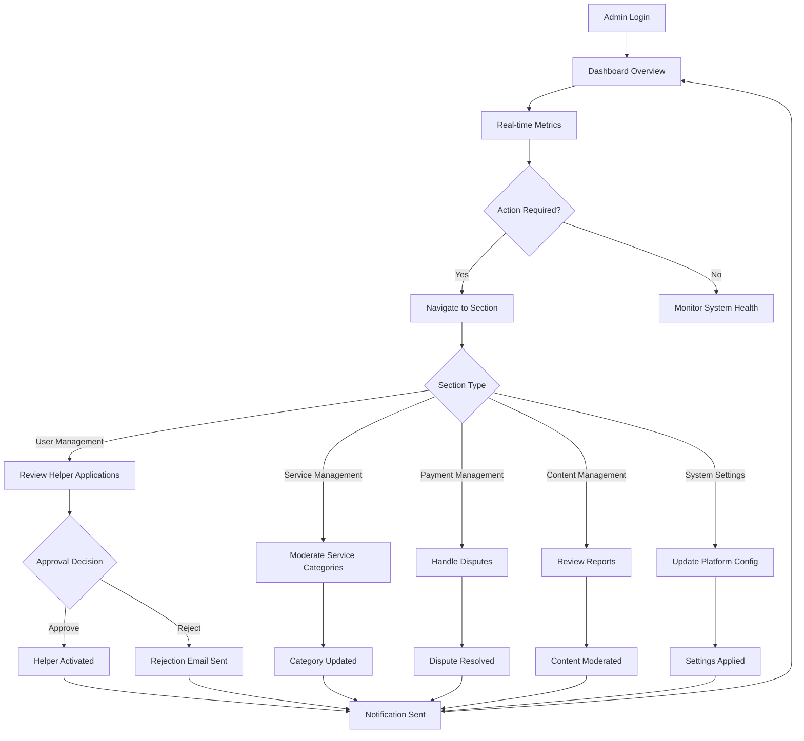

## 11. Trust & Safety Verification Flow

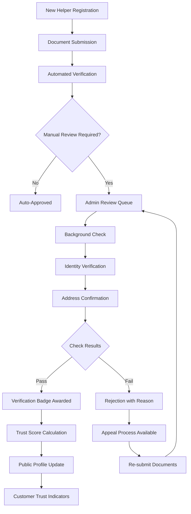

## 12. Referral & Loyalty Program Flow

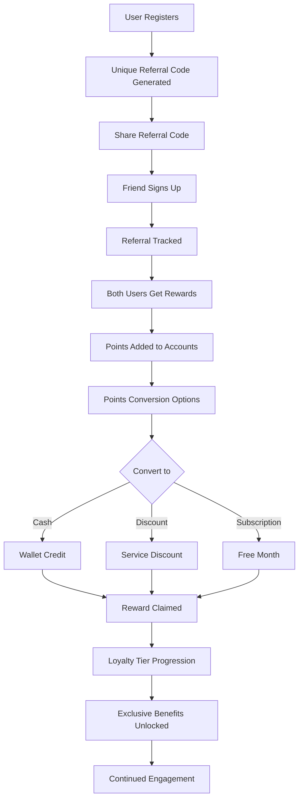

## 13. Video Consultation Flow

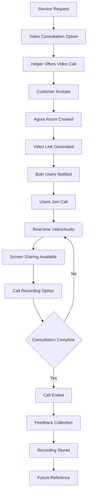

## 14. Payment Dispute Resolution Flow

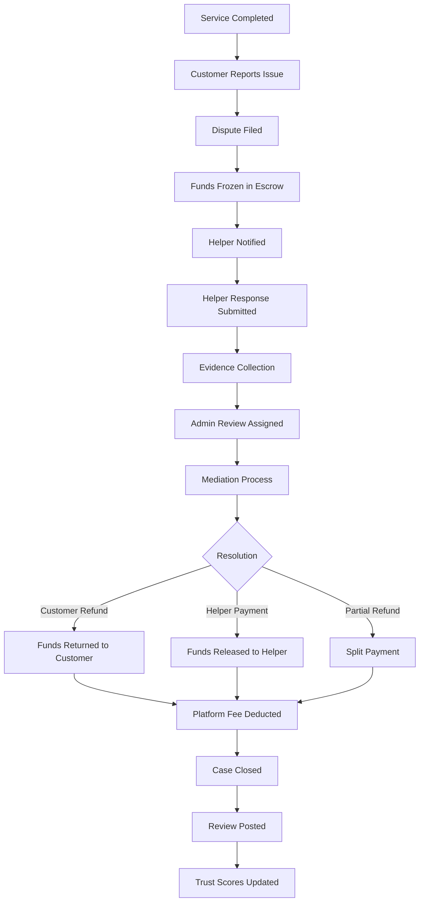

## 15. Gamification & Achievement System Flow

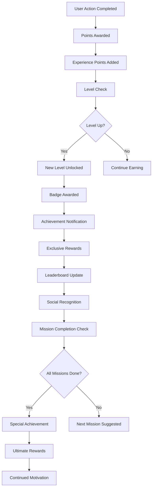

## System Integration Flow

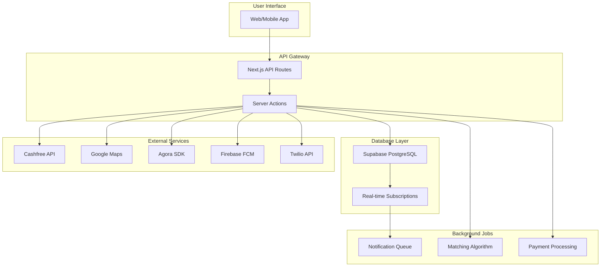

## Data Flow Architecture

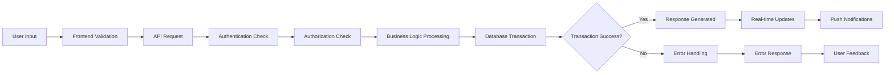

## Security & Trust Flow

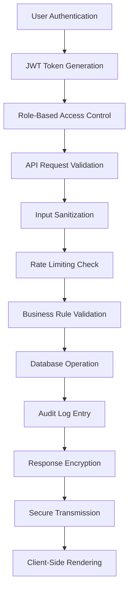

## Performance Monitoring Flow

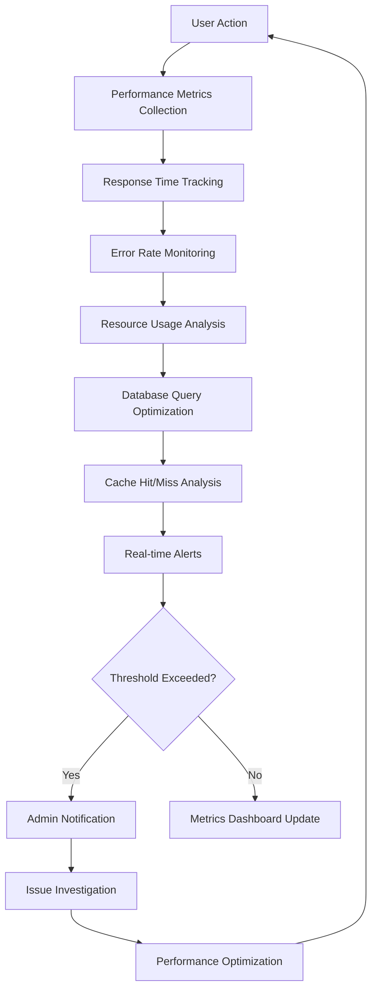

---

## Conclusion

These flow diagrams demonstrate the comprehensive, user-centric design of the Helparo Services platform. The visual representations showcase:

- **Seamless User Experience**: Intuitive flows from onboarding to service completion
- **Robust Security**: Multi-layered verification and trust systems
- **Scalable Architecture**: Modular design supporting rapid feature expansion
- **Real-time Capabilities**: Live updates and instant communications
- **Financial Security**: Escrow-based payment protection
- **Quality Assurance**: Comprehensive review and rating systems

The platform's flow efficiency ensures high user satisfaction, operational excellence, and sustainable business growth. Each diagram represents a critical user journey optimized for maximum value delivery and minimal friction.